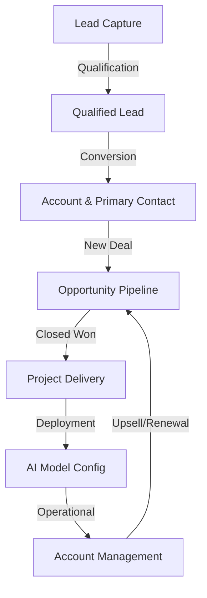
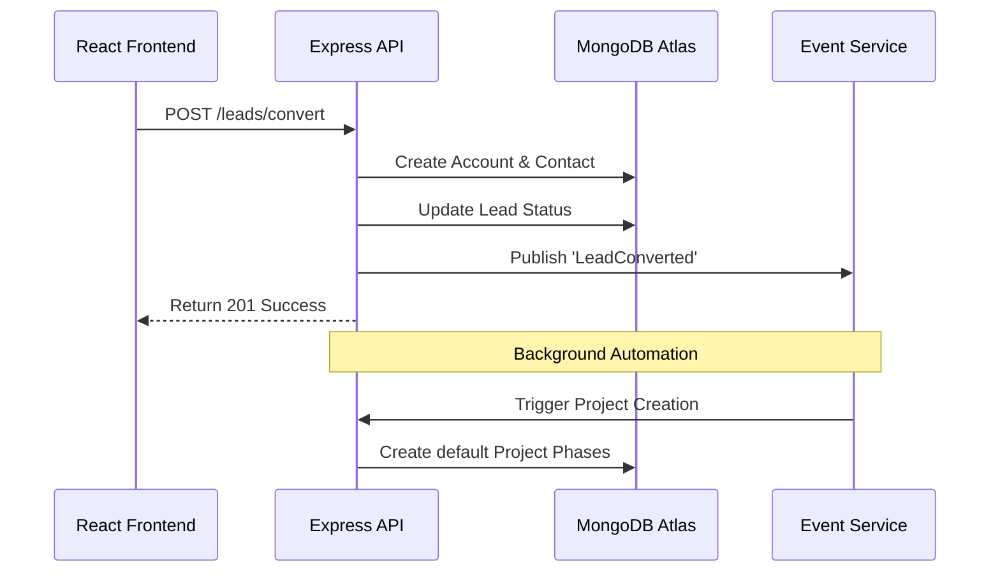

# Wersel CRM System Workflow

This document describes the end-to-end lifecycle of data and user interactions within the Wersel CRM system, covering both Backend operations and Frontend user flows.

## 1. Core Business Lifecycle

The CRM follows a standard B2B sales and delivery lifecycle, optimized for AI solution providers.

### Phase 1: Lead Management
- **Frontend**: Users capture potential clients in the **Leads** module.
- **Backend**: `LeadService` stores data. When a lead is marked "Qualified", an event is published.
- **Lifecycle**: Lead -> Converted (creates one **Account** and one **Contact**).

### Phase 2: Sales Pipeline (Opportunities)
- **Frontend**: Deals are managed in the **Kanban Board**. Stage advancement (e.g., Proposal -> Negotiation) updates deal probability.
- **Backend**: `OpportunityService` tracks weighted value and triggers events upon status change.
- **Lifecycle**: Prospecting -> Closed Won. 

### Phase 3: Project Delivery
- **Frontend**: The **Projects** module displays the results of a Won Deal. it shows delivery phases (Data Prep, Model Dev).
- **Backend**: Automation automatically creates a Project and 5 default Phases when an Opportunity hits "Closed Won".

---

## 2. New Module Workflows

### Accounts & Contacts
- **Purpose**: Centralized storage for client company data and a directory of stakeholders.
- **Workflow**: 
    1. View Account details with associated Contacts and active Projects (Virtual populated in MongoDB).
    2. Add stakeholders to an existing Account.
    3. Track Account health based on active AI projects.

### Reports & Analytics
- **Purpose**: Data-driven insights for management.
- **Workflow**:
    1. **Reports**: Tabular and exportable summaries of Sales performance.
    2. **Analytics**: Visual trends (Revenue growth, Lead source effectiveness, Win rates).
    3. **Backend**: Aggregation pipelines in `DashboardService` provide real-time data.

---

## 3. Full System Architecture

